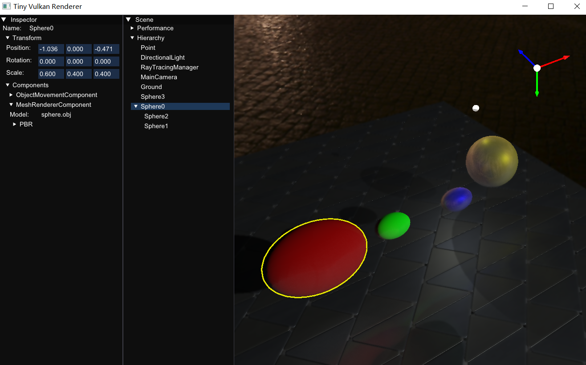

# Vulkan Renderer

## Progress

---------------2023----------------

9.17 完成了基本的3D单物体渲染以及Transform变换

9.18 添加了正交投影以及透视投影

9.19 实现了相机移动，视角转动

9.20~9.21 完成程序结构示例图

9.23~9.24 完成几何着色器动态生成三维分形

10.4 添加了index buffer，更改了buffer属性为device local并配合staging buffer以优化性能

10.5 添加了对obj文件的读取功能(调用了tiny obj loader库)，同时根据obj文件数据建立index buffer，难点在于对自定义vertex类型的hash模板特化重载

10.6 添加了最简单的diffuse光照，抽象提取了Buffer类（依靠开源代码），创建了Uniform Buffer

10.8 使用Uniform Buffer，实现逐像素光照

10.14 实现了光源的可视化(Billboard)，实现了多光源光照

10.21 添加了alpha blending, 初起image类

10.22 完成纹理采样，但是没有封装不同物体使用不同的材质

10.28 对于不同的物体，封装了不同的材质，即可以使用不同的纹理，所有object以及material信息均在json中配置，但自定义程度还有改进

11.12 初步完成阴影效果，还有待优化的点：点光源全角度阴影

---------------2024----------------

1.1 Completed dynamic generated and interactive grass.

3.24 Modified GameObject architecture, using m_components to replace hard-coded member variables.

3.25 Fixed the problem when exiting the programme memory is not correctly released.

3.27 Optimized run loop code structure, made camera as a component.

4.17 Supported cube map. Added sky box.

4.24 Completed point light omni-directional shadow map with cube map.

5.5 Optimized input system. Make it as a component.

5.7 Reconstructed game object and component system. Make all objects and m_components load from the configuration file. Fixed the issue of resizing the window leading cube map recreation failed.	

5.10 Built the framework of creating ray tracing BLAS.

5.22 Periodical backup.

5.23 Constructed TLAS.

5.25 Created ray tracing descriptor set. Using macro definitions to switch between ray tracing and rasterization.

5.26 Completed ray tracing descriptors.

5.28 Created ray tracing m_pipeline.

5.29 Created shader binding table. 

6.2 Started rendering by very basic ray tracing.

6.30 Added simplest lighting. Fixed the problem that vertex memory alignment does not match between host and m_device. 

7.1 Added directional light shadow.

7.2 Completed multiple game objects, materials (shaders, textures) ray tracing.

7.8 Completed PBR rendering.

7.10 Completed transparent object rendering. Completed semi-transparent object and shadow. Supported dynamic acceleration structure. 

7.13 Added a basic GUI, using ImGUI framework.

7.16 Adjusted resolution, making window resizing is compatible with rendered image. Completed simple GUI.

7.17 Completed basic UI system. Added skybox. Adjusted color space.

7.19 Fixed rasterization rendering.

7.23 Optimized rasterzation pipeline shadow map.

7.25 Optimized camera movement.

7.28 Added gizmos render pass. Added a fixed axis to indicate directions.

7.31 Added selected model outline.

8.22 Completed simple global illumination in static scene. Using bilateral filter and temporal denoising.

8.24 Completed simple global illumination in dynamic scene.

8.26 Released v0.1.0

9.24 Completed GameObjects hierarchy. There are parent and child objects now, and their transforms will be synchronized.

11.17 Optimized synchronization between frames. In ray tracing rendering, the flickering while moving or rotating the camera is fixed.

11.20 Realised RigidBodyComponent.